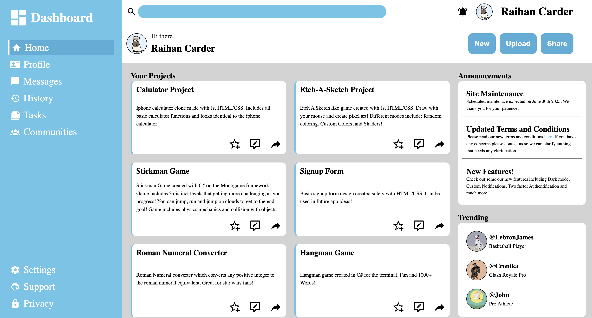

# Admin Dashboard
A Responsive Admin Dashboard made with HTML/CSS.

This project helped me fully understand Grids and improved my HTML/CSS knowledge!

## Features

- Responsive layout using CSS Grid and Flexbox
- Sidebar navigation with hover effects
- Search bar and profile section
- Scrollable project and announcement panels
- Trending user display

[Live Demo](https://raihanCarder.github.io/admin-dashboard/)

## Screenshot

## Installation

1. Clone the repo  
   `git clone https://github.com/raihanCarder/admin-dashboard.git`

2. Navigate to the folder  
   `cd admin-dashboard`

3. Open `index.html` in your browser (or run with Live Server)

## Tech Stack
- HTML
- CSS

Created by Raihan Carder(https://github.com/raihanCarder)  
Feel free to reach out!

